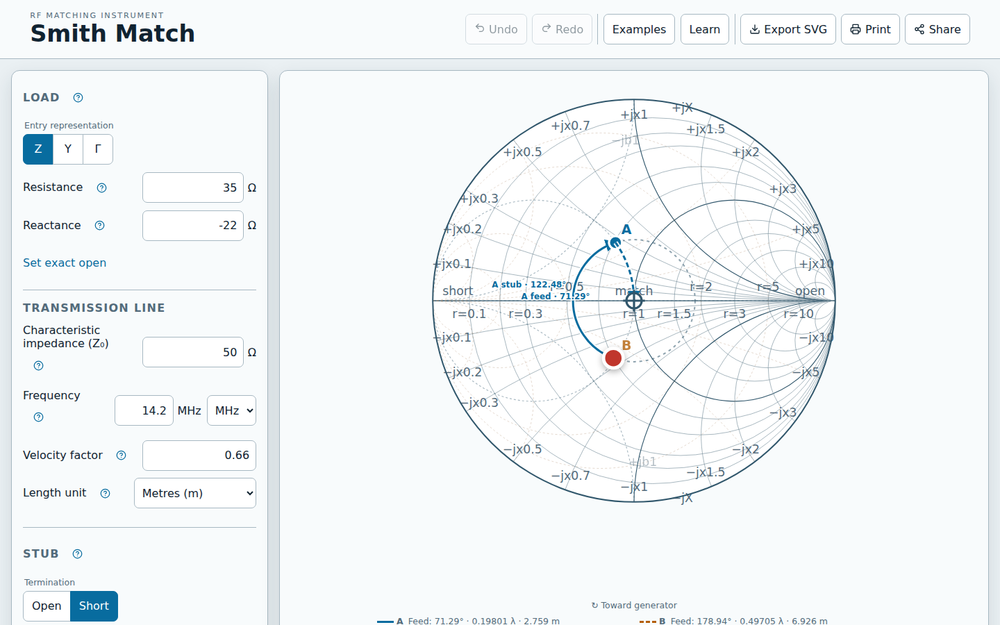
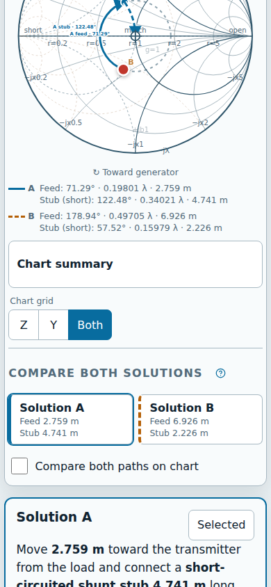

# Smith Match

Interactive, accessible Smith chart for calculating and explaining lossless single shunt-stub
impedance matches—entirely in your browser.

[](https://github.com/wmacomber/smithchart/actions/workflows/ci.yml)
[](https://github.com/wmacomber/smithchart/actions/workflows/pages.yml)
[](LICENSE)
[](CHANGELOG.md)

## [Try Smith Match live](https://wmacomber.github.io/smithchart/)



Smith Match places a load on a native SVG Smith chart, rotates it toward the generator to both
valid $g=1$ junctions, calculates an open- or short-circuited shunt stub, and presents practical
construction lengths with residual verification.

### Capabilities

- Impedance, admittance, reflection-coefficient, pointer, touch, and keyboard load entry
- Both canonical matching solutions with electrical, metric, and customary lengths
- Impedance, admittance, or combined chart grids with textual equivalents
- Shareable URL state, standalone SVG export, and printable worksheet
- Responsive light/dark UI, reduced-motion support, and offline reload after a successful visit
- Pure TypeScript RF engine checked against an independent Python formulation

### Model limits

Version 1 models one frequency, a real positive characteristic impedance, lossless feed line, and
one lossless open or short shunt stub. It is not a VNA, circuit simulator, frequency sweep, lossy-line
model, or microstrip synthesizer. Calculated lengths are starting values: connectors, discontinuities,
dielectric tolerance, coupling, nearby objects, and line loss affect a physical build.

## Quick start

Use [Bun](https://bun.sh/) `1.3.14`, matching CI and the committed lockfile.

```bash
git clone https://github.com/wmacomber/smithchart.git
cd smithchart
bun install --frozen-lockfile
bun run dev
```

Vite prints the local development URL, normally `http://localhost:5173/`. Bun installs dependencies
and runs scripts; deployed code uses no Bun runtime API. `bun run build` emits static files in `dist/`.

## Use the instrument

1. Enter the load as impedance, admittance, or reflection coefficient—or move the chart marker.
2. Set characteristic impedance, frequency, velocity factor, and open/short termination.
3. Compare Solution A and B, then select the construction that fits the installation.
4. Share the calculation URL, export a standalone chart, or print a worksheet.

Keyboard users can focus **Load marker**, use Arrow keys for fine movement, Shift+Arrow for coarse
movement, Enter to commit, and Escape to cancel. The visible Chart summary supplies a complete text
equivalent.



## Architecture

```text
URL calculation state ──► reducer/history ──► pure RF solver ──► chart + results
                                ▲                    │
localStorage preferences ───────┘                    └──► sanitized SVG/print output

static Vite build ──► GitHub Pages ──► service-worker application precache
```

`src/rf` owns deterministic domain math and imports nothing outside itself. `src/chart` owns SVG
geometry and interaction mapping. `src/app` owns state transactions. `src/features` owns workflows;
`src/persistence` owns browser boundaries. No backend, account, analytics, or runtime API exists.
The RF modules are internal reusable code, not a published package API. See the full
[architecture](docs/architecture.md) and [ADRs](docs/adr/README.md).

## Mathematics and signs

The solver uses the $e^{+j\omega t}$ phasor convention. Positive reactance is inductive; positive
susceptance is capacitive. With distance measured from load toward generator,

$$
\Gamma(d_\lambda)=\Gamma_L e^{-j4\pi d_\lambda},
$$

so movement is clockwise in mathematical reflection-coefficient space. Mathematical positive
imaginary values appear above the chart axis; only the renderer inverts SVG Y coordinates. Feed-line
and stub lengths use $[0,0.5\lambda)$; the shorter feed-line distance is Solution A.

See [mathematics](docs/mathematics.md), authoritative [sign conventions](docs/conventions.md), and
[RF reference evidence](tests/reference-cases/README.md).

## Develop and verify

| Command                             | Purpose                                           | Prerequisite / artifact            | In `bun run ci` |
| ----------------------------------- | ------------------------------------------------- | ---------------------------------- | :-------------: |
| `bun run dev`                       | Start Vite development server                     | Installed dependencies             |       No        |
| `bun run build`                     | Type-check and create production build            | Writes `dist/`                     |       Yes       |
| `bun run preview`                   | Serve an existing production build                | Run `bun run build` first          |       No        |
| `bun run format:check`              | Check Prettier formatting                         | None                               |       Yes       |
| `bun run lint`                      | Run ESLint                                        | None                               |       Yes       |
| `bun run typecheck`                 | Run project TypeScript builds                     | None                               |       Yes       |
| `bun run test`                      | Run all Vitest tests                              | Writes temporary cache only        |       Yes       |
| `bun run test:rf`                   | Run focused RF tests                              | None                               |       No        |
| `bun run test:chart`                | Run focused chart tests                           | None                               |       No        |
| `bun run test:e2e`                  | Build, preview, and run Playwright matrix         | Installed browser binaries         |       No        |
| `bun run test:e2e:pages`            | Test `/smithchart/` offline deployment path       | Chromium                           |       No        |
| `bun run check:rf-boundary`         | Prove RF code remains pure and standalone         | None                               |       Yes       |
| `bun run verify:references`         | Run dependency-free Python RF verifier            | Python 3                           |       Yes       |
| `bun run verify:no-runtime-network` | Reject runtime network APIs/assets                | None                               |       Yes       |
| `bun run verify:assets`             | Enforce JS, CSS, and precache budgets             | Current `dist/`                    |       Yes       |
| `bun run verify:offline`            | Audit service-worker/base-path artifacts          | Current `dist/`                    |       Yes       |
| `bun run verify:docs`               | Verify docs, ADRs, screenshots, versions, notices | Frozen install                     |       Yes       |
| `bun run verify:reproducible-build` | Compare two clean build digests                   | Writes `dist/` twice               |       No        |
| `bun run licenses`                  | Print verified lock-aligned license inventory     | Frozen install                     |       No        |
| `bun run licenses:write`            | Regenerate reviewed license/notice artifacts      | Intentional file changes           |       No        |
| `bun run capture:docs`              | Regenerate curated README screenshots             | Chromium; intentional file changes |       No        |
| `bun run ci`                        | Run deterministic pull-request gate               | Bun `1.3.14`, Python 3             |        —        |

Install Playwright browsers once with `bunx playwright install --with-deps`. Browser, accessibility,
visual, performance, export, and offline suites are documented in [testing](docs/testing.md).

## Accessibility, privacy, and security

Mouse, touch, keyboard, textual, reduced-motion, forced-color, reflow, and desktop/mobile browser
workflows have automated coverage. Automated ARIA-tree and axe evidence gates releases; manual
VoiceOver and TalkBack sessions remain welcome exploratory validation. Details and known limits live
in [accessibility documentation](docs/accessibility.md).

Calculation state appears in the URL and may be visible in browser history or copied links. Display
preferences remain in local storage. The app sends neither to a server. A visited build can reload
offline after service-worker activation; first-ever offline loading and installable PWA behavior are
not supported. Report vulnerabilities privately under the [security policy](SECURITY.md).

## Contributing and license

Read [Contributing](CONTRIBUTING.md), the [Code of Conduct](CODE_OF_CONDUCT.md), and
[Security Policy](SECURITY.md) before opening work. Changes follow the [changelog](CHANGELOG.md) and
[versioning policy](docs/versioning.md).

Smith Match is [MIT licensed](LICENSE); project files need no additional per-source license header.
Distributed dependency notices appear in [Third-Party Licenses](THIRD_PARTY_LICENSES.md). External RF
sources establish method and convention; project fixtures remain project-authored evidence and imply
no endorsement.

## Origin

Smith Match was inspired by Veritasium's
[_The Scariest Chart In Electrical Engineering_](https://www.youtube.com/watch?v=GK2pZ_oVU1o).
The chart turned a half-learned antenna lesson—why an apparently disconnected wire can improve a
received signal—into transmission-line behavior that could be seen, calculated, and built.
