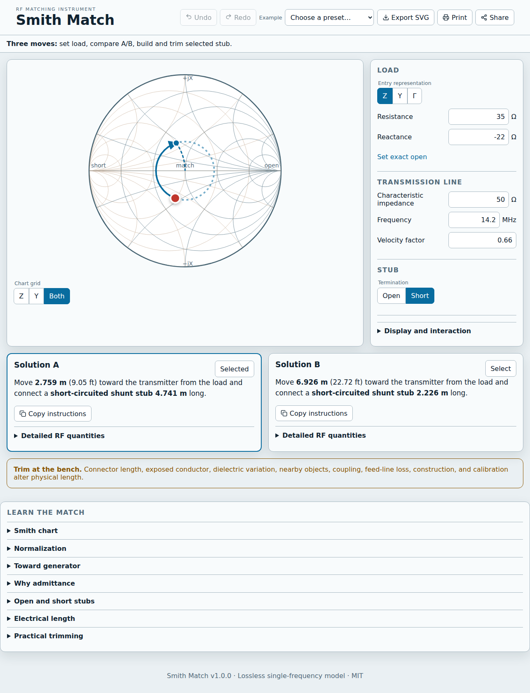

# Smith Match

Browser-only RF instrument for calculating and explaining lossless single shunt-stub impedance matches. Interactive native SVG Smith chart shows load rotation, both `g=1` junctions, required open/short stub, physical construction lengths, and residual verification.



## Features

- Two valid solutions with impedance, admittance, electrical, metric, and customary values
- Impedance, admittance, reflection-coefficient entry and direct chart manipulation
- Mouse, touch, keyboard, responsive themes, textual chart equivalent
- Shareable URL, SVG export, print worksheet, offline reload
- Pure independently verified TypeScript RF engine

## Develop

```bash
bun install --frozen-lockfile
bun run dev
bun run ci
bun run build
bun run test:e2e
```

Vite builds static `dist/`. `BASE_PATH=/repository/ bun run build` supports GitHub Pages project paths. No server runtime or runtime network API exists.

See [architecture](docs/architecture.md), [mathematics](docs/mathematics.md), [contributing](CONTRIBUTING.md), and [security](SECURITY.md).

MIT licensed.
